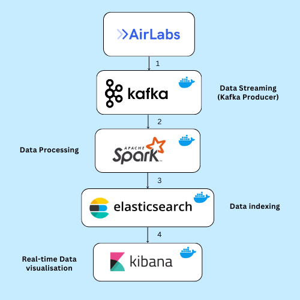
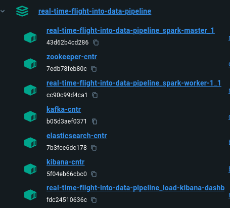

<h1 align="center">
  <br>
  Real-Time-flight-into-data-pipeline Dashboard
</h1>
<div align="center">
  <h4>
    <a href="#overview">Overview</a> |
    <a href="#data-pipeline-overview">Data Pipeline Overview</a> |
    <a href="#dockerized-environment">Dockerized Environment</a> |
    <a href="#prerequisites">Prerequisites</a>
    <a href="#setup-and-running-instructions">Setup and Running Instructions</a> |
    <a href="#how-to-launch-kibana-dashboard">How to launch kibana dashboard</a> |
  </h4>
</div>
<br>

## Overview

In this project, we will use a real-time flight tracking API, Apache Kafka, ElastichSearch and Kibana to create a real-time Flight-info data pipeline and track the flights in real-time. We will use a high-level architecture and
corresponding configurations that will allow us to create this data pipeline. The end result will be a Kibana dashboard fetching real-time data from ElasticSearch.

## Data Pipeline Overview
Our project pipeline is as follows:
- **Kafka**: Ingests real-time data from airlabs api.
- **Spark**: Processes and analyzes the data.
- **Elasticsearch**: Stores and indexes the processed data.
- **Kibana**: Visualizes insights on an interactive dashboard.





## Dockerized Environment 

To ensure seamless operation and management, our Real-time-flight-into-data-pipeline is built upon a Dockerized environment, encapsulating each component of the system within its own container. This approach not only fosters a modular architecture, making it easier to update and maintain individual parts without affecting the whole system, but also enhances scalability and fault tolerance. Each service, from Kafka for real-time data ingestion to Kibana for insightful visualizations, operates in an isolated yet interconnected manner through a custom Docker network. This setup not only reflects best practices in container orchestration but also provides a robust, scalable solution for real-time data processing and visualization. By adopting this architecture, users can enjoy a streamlined setup process, predictable behavior across environments, and a flexible system ready to adapt to future needs and improvements.


## Prerequisites

- Docker Desktop: Ensure Docker Desktop is installed and running on your system.
- Python: Ensure Python is installed for running the Kafka producer script.

## Setup and Running Instructions
1. Start the Docker Containers: 
    ```
    docker-compose up -d
    ```
2. Install Python dependencies:
    ```
    pip install -r requirements.txt
    ```
3. Run the Kafka Producer:
    ```
    python kafka_producer_api.py
    ```
4. Execute the Data Processing Scripts:
    - For Windows: `run.bat`
    - For Linux/MacOS: `run.sh`
5. Access Kibana Dashboard at `http://localhost:5601`.
 `

## How to launch kibana dashboard

- Open http://localhost:5601/ in your browser.
- Go to Management>Kibana>Saved Objects
- Import P2M-Dashbord.ndjson
- Open dashboard

## Final result

## Contributors
<a href="https://github.com/AnasBenAmor10/Real-Time-flight-into-data-pipeline/graphs/contributors">
    
</a>
