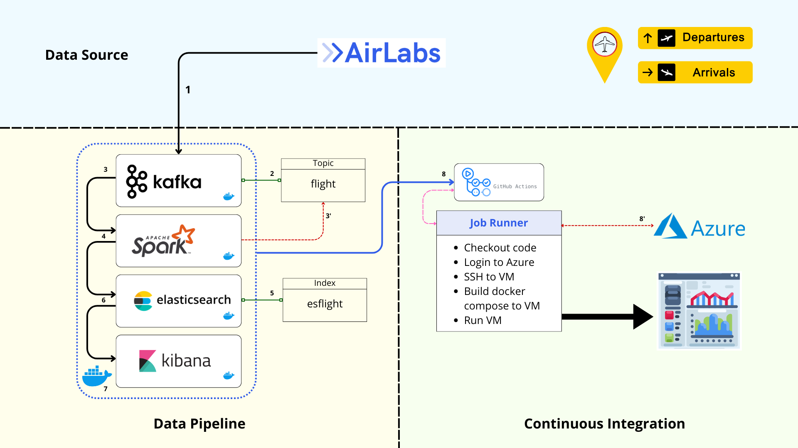
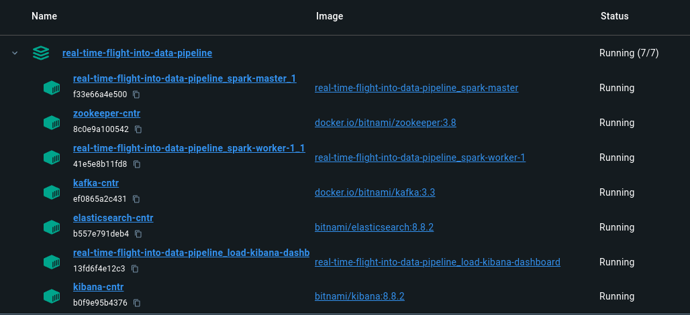

# Real-Time-flight-into-data-pipeline Dashboard


## Table of Contents

- [Overview](#overview)
- [Data Pipeline Overview](#data-pipeline-overview)
- [Dockerized Environment](#dockerized-environment)
- [Prerequisites](#prerequisites)
- [Setup and Running Instructions](#setup-and-running-instructions)
- [How to launch kibana dashboard](#how-to-launch-kibana-dashboard)
- [Final result](#final-result)

## Overview

In this project, we will use a real-time flight tracking API, Apache Kafka, ElastichSearch and Kibana to create a real-time Flight-info data pipeline and track the flights in real-time. We will use a high-level architecture and
corresponding configurations that will allow us to create this data pipeline. The end result will be a Kibana dashboard fetching real-time data from ElasticSearch.

## Data Pipeline Overview
Our project pipeline is as follows:
- **Kafka**: Ingests real-time data from airlabs api.
- **Spark**: Processes and analyzes the data.
- **Elasticsearch**: Stores and indexes the processed data.
- **Kibana**: Visualizes insights on an interactive dashboard.



The solution involves retrieving real-time data from the Airlabs API, which contains a wealth of information related to air traffic and airport density. The data is transmitted through a Kafka producer and recorded in a topic named flight. For data processing, we use Apache Spark. The Spark session subscribes to the flight topic and downloads the data from it. After the processing operation, the data is sent to Elasticsearch and recorded in the esflight index of Elasticsearch. Using the Kibana dashboard, we can visualize the data in real time and with precision. The GitHub Actions part of our solution allows us to automate the deployment of the real-time data processing pipeline. When a change is made on GitHub, GitHub Actions triggers to execute multiple jobs. First, the Docker images of the various components are rebuilt. Then, these images are deployed on an Azure virtual machine. This continuous integration ensures that our system is always up-to-date and operational, enabling efficient real-time data management and precise visualization via the Kibana dashboard.


## Dockerized Environment

To ensure seamless operation and management, our Real-time-flight-into-data-pipeline is built upon a Dockerized environment, encapsulating each component of the system within its own container. This approach not only fosters a modular architecture, making it easier to update and maintain individual parts without affecting the whole system, but also enhances scalability and fault tolerance. Each service, from Kafka for real-time data ingestion to Kibana for insightful visualizations, operates in an isolated yet interconnected manner through a custom Docker network. This setup not only reflects best practices in container orchestration but also provides a robust, scalable solution for real-time data processing and visualization. By adopting this architecture, users can enjoy a streamlined setup process, predictable behavior across environments, and a flexible system ready to adapt to future needs and improvements.



## Prerequisites

- Docker Desktop: Ensure Docker Desktop is installed and running on your system.
- Python: Ensure Python is installed for running the Kafka producer script.

## Setup and Running Instructions
1. Start the Docker Containers: 
    ```
    docker-compose up -d
    ```
2. Install Python dependencies:
    ```
    pip install -r requirements.txt
    ```
4. Run the Kafka Producer:
   - If You  Have an Account in airlanb using your api_key
    ```
    python3 kafka_producer_api.py
    ```
   - Sinon
    ```
    ./data python3 kafka_producer.py
    ```
      
6. Execute the Data Processing Scripts:
    - For Windows: `run.bat`
    - For Linux/MacOS: `run.sh`
7. Access Kibana Dashboard at `http://localhost:5601`.
 `
> [!NOTE]
> Useful information that users should know, If importing export.ndjson into Kibana through Docker does not work, the next step is to perform the importation manually through the Kibana
## How to launch kibana dashboard 

- Open http://localhost:5601/ in your browser.
- Go to Management>StackManagement>Kibana>Saved Objects
- Import export.ndjson from kibana folder which is in my repo 
- Open dashboard

## Final result
Let us now focus on the graphs developed during the data visualization process. After consulting aviation experts and airport administrators, we have chosen to divide our dashboard into three sections: airport information, flight information, and aircraft information.
### Airport Information
-For this section of the dashboard, we focused on information useful for airport administrators, notably the total number of flights related to that airport and the flow of departures and arrivals. The figure above shows an overview for all airports, but the available filters allow selecting a specific airport or region.


### Flight Information
-For this part of the dashboard, and following the advice of experts regarding the necessary information, we chose to visualize on the map the position of aircraft, their departure and arrival airports sorted by their speeds or altitudes as needed. Then, on the left, we have for each type of aircraft, the types of routes it operates. We notice that the larger the aircraft, the more capable it is of performing long-haul flights. Similarly, we can see on the right side of the drawing, the most frequent flights by geographical region. This approach provides the most information possible about the nature of flights, their frequencies, and the type of aircraft that operates them.


### Aircraft Information
-Finally, for the section related to the aircraft itself, using the data available on the API, we can determine the average and maximum speeds of aircraft as well as their speeds relative to their altitudes to ultimately identify the fastest aircraft and rank them in descending order.


### Filters' addition
-En plus des graphiques, nous avons élaboré une variété de filtres qui rendent le dashboars personnalisable et interactif. Notamment, nous utilisons un filtre pour le code de vol, le départ ou l'arrivée, le status du vol ou son type mais aussi la companie aérienne et le code d'avion.
On trouve les filtres dans l'entête du dashboard comme suit:


## Contributors
<a href="https://github.com/AnasBenAmor10/Real-Time-flight-into-data-pipeline/graphs/contributors">
    
  
</a>
